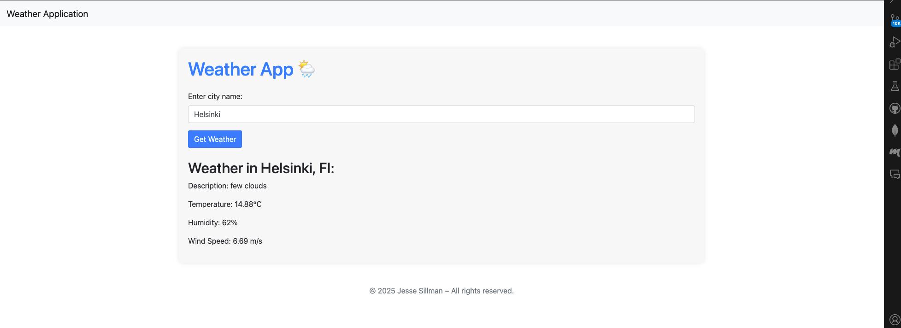

# Weather App 🌦️

I implemented a simple weather application using `OpenWeatherMap API` to fetch real-time weather data
based on user input. The application includes a `Flask` backend defined in `app.py`, a frontend built with `templates/index.html` using `Bootstrap` for styling and `Dockerfile` for containerized deployment, and a `requirements.txt` file to manage Python dependencies.

# Usage

You're welcome to use and change the code in any way you like. Have fun building! 🤖